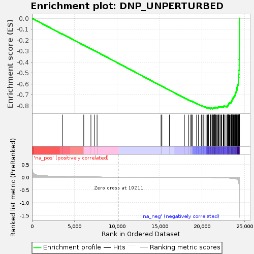
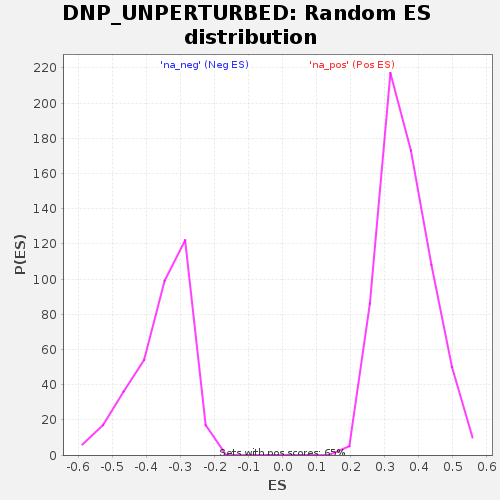
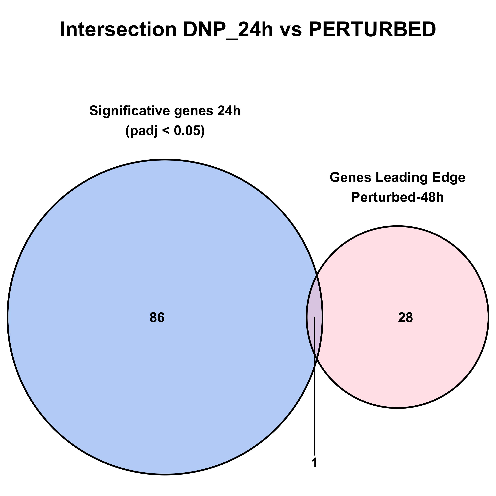
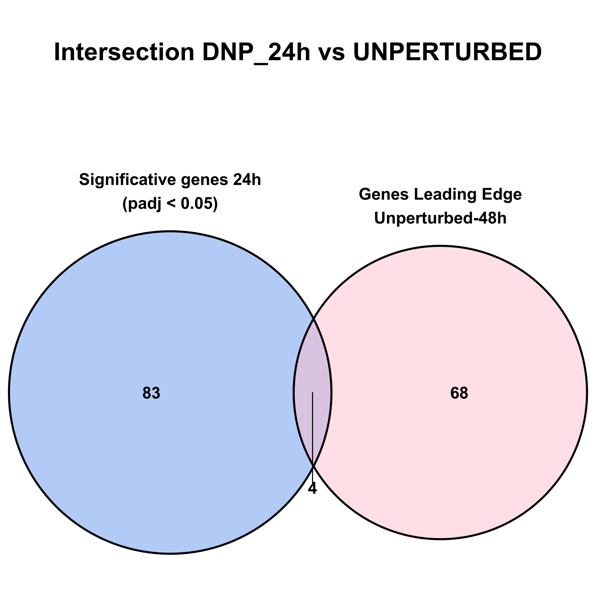

```{r setup_Rmd, include=FALSE}
knitr::opts_hooks$set(eval = function(options) {
  if (options$engine == "bash") {
    options$eval <- FALSE
  }
  options
})
```

# Software utilizado

Para el análisis GSEA a realizar se han utilizado la versión de R y los siguientes paquetes/version:

```{r, setup, echo=FALSE, message=FALSE, warning=FALSE}
rm(list = ls()) # R version 4.2.2 
library(tidyverse) # tidyverse_2.0.0
library(DESeq2) # DESeq2_1.38.0
#install.packages("VennDiagram")
library(VennDiagram)

paste("Versión R:",packageVersion("base"))
paste("Versión tidyverse:",packageVersion("tidyverse"))
paste("Versión DESeq2:",packageVersion("DESeq2"))
paste("Versión VennDiagram:",packageVersion("VennDiagram"))

```

# Creacion de archivo .rnk

Para este análisis de GSEA vamos a optar por realizar la opción **pre-ranked**, esta opción necesita de:

1. Archivo .gmt que define los gene sets: este archivo nos lo dan y contiene un gen set con los 100 genes más up-regulados en el tratamiento a 48 horas (DPN-Perturbed) y otro gen set con los 100 genes más down-regulated (DPN-UNPERTURBED).
2. Archivo .rnk: archivo de texto que debemos generar y que contiene una lista de genes y sus puntuaciones de clasificación correspondientes. La puntuación de clasificación es una medida que indique la importancia o el grado de expresión del gen en una muestra o condición en particular, en nuestro caso utilizaremos el logFold Change (LFC).

Para crear este archivo cargamos el objeto DESeq2 `dd3` creado en el apartado anterior y realizamos el contraste entre DPN24 horas y Control 24 horas.

```{r}
dds_GSEA <- readRDS("input/dds3.rds")
res <- results(dds_GSEA, alpha = 0.05, contrast = c("group", "DPN24h", "Control24h"))
summary(res)
```

Para generación de los archivos .rnk es recomendable "reducir" ("shrunken") los datos, este concepto se refiere a un método estadístico que busca mejorar  la precisión de las estimaciones de los parámetros, reduciendo el error de la varianza. Para ello utilizaremos la función `lfcShrink`, con los siguientes parámetros:

- dds: es el objeto DESeq donde tenemos el modelo y los ajustes realizado
- coef: especifica el índice del coeficiente de la matriz de diseño que corresponde al contraste de interés.
- type: se refiere al método utilizado para realizar el shrunken. En este caso se escoge `apeglm`. El método APEglm (An Adaptive Permutation-based Extreme-value Gene Set Test for RNA-seq Data) utiliza una técnica de ajuste "shrunken" para reducir el ruido y mejorar la precisión de las estimaciones de expresión génica. En particular, APEglm utiliza un enfoque bayesiano empírico para encoger las estimaciones de la expresión génica hacia cero si la evidencia estadística no es lo suficientemente fuerte.
- res: especifica el objeto con los resultados que contiene las estimaciones de los LFC para cada gen.

Si analizamos el resultado de esta función podremos comprobar que el resultado en cuanto a los genes diferencialmente expresados es el mismo.

```{r}
res.ape <- lfcShrink(dds = dds_GSEA, coef = "group_DPN24h_vs_Control24h", type = "apeglm",
                     res = res)
summary(res.ape)
```
De manera gráfica podemos ver la diferencia entre los datos sin "encoger" y los datos "encogidos". La varianza se ha reducido y ahora los datos son más precisos.
```{r, plot_shrunken, echo=FALSE, out.width='75%', fig.align='center'}
par(mfrow = c(1, 2))
plotMA(res, ylim = c(-3, 3))
plotMA(res.ape, ylim = c(-3, 3))
```
Lo último que hacemos es guardar todos estos datos en un archivo con extensión '.rnk'.
```{r}
rnk <- data.frame(Feature = rownames(res.ape), LFC = res.ape$log2FoldChange)
write.table(rnk, file = "./input/DPN-Control_24h.rnk", sep = "\t", quote = FALSE, 
            col.names = FALSE, row.names = FALSE)

```

# Analisis GSEA

Para realizar el análisis utilizamos la aplicación para escritorio de GSEA, cargando los dos archivos necesarios y procesando la información con la opción pre-ranked. Los parámetros utilizados se pueden ver en el siguiente código:

```{bash}
gsea-cli.sh GSEAPreranked \
-gmx /home/vant/Documentos/14_Transcriptomica/transcriptomic-final-exercise/Apartado2/input/DPN_response.gmt \
-collapse Remap_Only \
-mode Abs_max_of_probes \
-norm meandiv \
-nperm 1000 \
-rnd_seed 123 \
-rnk /home/vant/Documentos/14_Transcriptomica/transcriptomic-final-exercise/Apartado2/input/DPN-Control_24h.rnk \
-scoring_scheme weighted \
-rpt_label DPN_Control \
-create_svgs false \
-include_only_symbols true \
-make_sets true \
-plot_top_x 20 \
-set_max 500 \
-set_min 15 \
-zip_report false \
-out /home/vant/Documentos/14_Transcriptomica/transcriptomic-final-exercise/Apartado2
```

## Resultados

### Gene set DPN PERTURBED

Para este gene set, GSEA ha detectado un enriquecimiento. El resumen de resultados mostrado más abajo, nos indica el que valor de `nominal p-value = 0` (que significaria que es 1/1000) y su FDR (valor ajustado a multiple test) es de 0 también. También podemos ver los valores del Enrichment Score (ES) y su valor normalizado (NES).

```{r, echo=FALSE}
perturbed <- read.table(file = "./Apartado2_GSEA_DPN.GseaPreranked.1681077764275/gsea_report_for_na_pos_1681077764275.tsv", header= T, sep = "\t")
perturbed[c(1,5:8)]
```

Si entramos en "Detalles" podemos ver el gráfico característico de este tipo de estudios, el cual nos indica que el gene set está enriquecido en los valores altos de la tabla, es decir, en los que se presupone sobreexpresados. Estos concuerda ya que el gene-set corresponde con los valores de genes sobreexpresados a 48 horas. El otro gráfico muestra la Random ES Distribution, una representación gráfica de la distribución de los Enrichment Scores obtenidos en las permutaciones aleatorias que se utilizan para calcular el ES, su distribución hacia la derecha nos indica que está significativamente enriquecido.

```{r, echo=FALSE, out.width="50%"}
knitr::include_graphics("./Apartado2_GSEA_DPN.GseaPreranked.1681077764275/enplot_DPN_PERTURBED_1.png")
knitr::include_graphics("./Apartado2_GSEA_DPN.GseaPreranked.1681077764275/gset_rnd_es_dist_2.png")
```

Por último, en esta misma sección de "Details" podemos ver que genes del gene-set forman parte del "core enrichment", es decir conforman el **Leading Edge**. En este gene-set el leading edge lo conforman 29 genes que a continuación podemos ver (filtrados por core.enrichmen == yes), así como su posición en la gene-list y las diferentes métricas del ensayo GSEA.

```{r, echo=FALSE}
DPN48h_perturbed <- read.table(file = "./Apartado2_GSEA_DPN.GseaPreranked.1681077764275/DPN_PERTURBED.tsv", header = T, sep = "\t")
DPN48h_perturbed <- subset(DPN48h_perturbed, CORE.ENRICHMENT == "Yes")
DPN48h_perturbed[2:5]
```

### Gene set DPN UNPERTURBED

En este segundo Gene Set que contenia los 100 genes más down-regulated del experimento a 48 horas, nuestro análisis GSEA también ha encontrado un enriquecimiento. Como en el gene set anterior, mostramos el resumen general para este enriquecimiento, en el cual comprobamos de nuevo los valores de ES y su normalización (NES). Asimismo, vemo que el valor nominal de p-valor es 0 y su transformación para multiple test (FDR) también, lo cual refleja su significancia.

```{r}
unperturbed <- read.table(file = "./Apartado2_GSEA_DPN.GseaPreranked.1681077764275/gsea_report_for_na_neg_1681077764275.tsv", header= T, sep = "\t")
unperturbed[c(1,5:8)]
```

En cuanto a los gráficos caracteristicos, en el primero de ellos podemos ver como la curva se desplaza hacia abajo y hacia la derecha, lo cual es un enriquecimento en genes localizados en la parte inferior (zona down-reg) por parte de este gene set; de nuevo, esto concuerda con el gene set aportado. En el segundo gráfico, vemos el desplazamiento a la derecha lo que nos refleja una significancia de ese enriquecimiento.

```{r, echo=FALSE, out.width="50%"}


```

Al igual que en el caso anterior, mostramos a continuación en formato tabla el grupo de genes pertenecientes al **Leading Edge*, es decir aquellos genes que son el núcleo o los más importantes para el enriquecimiento y que en este caso son los localizados a la derecha del ES. En este grupo encontramos más genes que para el apartado anterior, llegando hasta los 72.

```{r}
DPN48h_unperturbed <- read.table(file = "./Apartado2_GSEA_DPN.GseaPreranked.1681077764275/DNP_UNPERTURBED.tsv", header = T, sep = "\t")
DPN48h_unperturbed <- subset(DPN48h_unperturbed, CORE.ENRICHMENT == "Yes")
DPN48h_unperturbed[2:5]


```

# Conclusion

Partiendo de la premisa de que el gen set PERTURBED contenia los 100 up-regulados y el gene set UNPERTURBED los 100 down-regulados, y que el enriquecimiento en estos gene set concuerda con la parte alta y la parte baja de la tabla, podemos interpretar que el tratamiento con DPN tiene un efecto significativo a lo largo del tiempo. 

Es decir, los genes que ya se encontraban en la zona de up-regulación (parte alta del .rnk), se encuentran significativamente up-regulados en el tratamiento a 48 horas. Esto mismo, pero sentido contrario, se puede interpretar para la zona baja o down-regulada.

Un análisis complementario que podemos realizar consiste en comprobar si los genes del Leading Edge se superponen con los genes significativamente sobreexpresados o infraexpresados que obtuvimos del experimento a 24 horas. 
```{r, eval=FALSE, echo=FALSE}

top_genes <- rownames(res.ape)[which(res.ape$padj < 0.05)]
ID_DPN48h <- DPN48h_perturbed$SYMBOL
ID_unDPN48h <- DPN48h_unperturbed$SYMBOL

venn.diagram(
  x = list(top_genes, ID_DPN48h),
  main = "Intersection DNP_24h vs PERTURBED",
  main.fontfamily = "sans",
  main.fontface = "bold",
  main.cex = 1.5,
  category.names = c(paste("Significative genes 24h", "(padj < 0.05)", sep = "\n"), paste("Genes Leading Edge", "Perturbed-48h", sep = "\n")),
  filename = "venn_diagram_DPN48h.png",
  output = TRUE,
  fill = c("cornflowerblue", "pink"),
  alpha = 0.5,
  label.col = c("black", "black", "black"),
  cex = 1,
  fontfamily = "sans",
  fontface = "bold",
  cat.pos = 0,
  cat.cex = 1,
  cat.dist = 0.05,
  cat.fontfamily = "sans",
  cat.fontface = "bold",
  ext.dist = -0.5,
)

venn.diagram(
  x = list(top_genes, ID_unDPN48h),
  main = "Intersection DNP_24h vs UNPERTURBED",
  main.fontfamily = "sans",
  main.fontface = "bold",
  main.cex = 1.5,
  category.names = c(paste("Significative genes 24h", "(padj < 0.05)", sep = "\n"), paste("Genes Leading Edge", "Unperturbed-48h", sep = "\n")),
  filename = "venn_diagram_Unper_DPN48h.png",
  output = TRUE,
  fill = c("cornflowerblue", "pink"),
  alpha = 0.5,
  label.col = c("black", "black", "black"),
  cex = 1,
  fontfamily = "sans",
  fontface = "bold",
  cat.pos = 0,
  cat.cex = 1,
  cat.dist = 0.05,
  cat.fontfamily = "sans",
  cat.fontface = "bold",
  ext.dist = -0.5,
)

```

A continuación mostramos los gráficos de Venn que muestran la intersección entre los genes que tenian un p-valor ajustado significativo en el experimento a 24 horas y los leading edge de cada gene set. Como vemos, aunque son muy pocos (1 y 4 genes), existen algunas concordancias. Estos genes que interseccionan podrían ser interesantes ya que supondrían genes que podrían estar actuando desde el comienzo del tratamiento y estar regulando otros, que podrían ser aquellos que no interseccionan. Una posible aproximación sería estudiar estos genes y las redes de interacción de los dos conjuntos para ver las concordancias entre ellos y si existe alguna "linea temporal" o procesos biológicos comunes.



```

